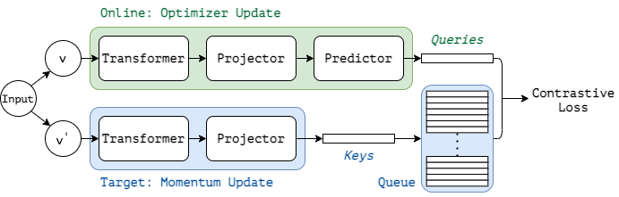

# Transformer Self-Supervised Learning

By [Zhenda Xie](https://github.com/zdaxie/)\*, [Yutong Lin](https://github.com/impiga)\*, [Zhuliang Yao](https://github.com/Howal), [Zheng Zhang](https://stupidzz.github.io/), [Qi Dai](https://www.microsoft.com/en-us/research/people/qid/), [Yue Cao](http://yue-cao.me) and [Han Hu](https://ancientmooner.github.io/)

This repo is the official implementation of ["Self-Supervised Learning with Swin Transformers"](). It currently includes code and models for the following tasks:

> **Self-Supervised Pre-training and Linear Evaluation with MoBY and Swin Transformer**: Included in this repo. See [get_started.md](get_started.md) for a quick start.

> **Object Detection and Instance Segmentation**: See [Swin Transformer for Object Detection](https://github.com/SwinTransformer/Swin-Transformer-Object-Detection).

> **Semantic Segmentation**: See [Swin Transformer for Semantic Segmentation](https://github.com/SwinTransformer/Swin-Transformer-Semantic-Segmentation).


## Updates

*** 05/10/2021 ***

Initial Commits:
1. Self-Supervised Pre-training models on ImageNet-1K([MoBY-Swin-T-100Ep](), [MoBY-Swin-T-BN-100Ep](), [MoBY-Swin-T-300Ep]()) are provided.
2. The supported code and models for self-supervised pre-training and ImageNet-1K linear evaluation, COCO object detection and ADE20K semantic segmentation are provided.

## Introduction

### MoBY

**MoBY** (the name `MoBY` stands for **Mo**Co v2 with **BY**OL) is initially described in [arxiv](). which is a combination of two popular self-supervised learning approaches: MoCo v2 and BYOL. It inherits the momentum design, the key queue, and the contrastive loss used in MoCo v2, and inherits the asymmetric encoders, asymmetric data augmentations and the momentum scheduler in BYOL.

`MoBY` achieves reasonably high accuracy on ImageNet-1K linear evaluation: 72.5\% and 75.0\% top-1 accuracy using DeiT and Swin-T, respectively, by 300-epoch training. The performance is on par with recent works of MoCo v3 and DINO which adopt DeiT as the backbone, but with much lighter tricks. 


### Swin Transformer

**Swin Transformer** (the name `Swin` stands for **S**hifted **win**dow) is initially described in [arxiv](https://arxiv.org/abs/2103.14030), which capably serves as a general-purpose backbone for computer vision. It is basically a hierarchical Transformer whose representation is computed with shifted windows. The shifted windowing scheme brings greater efficiency by limiting self-attention computation to non-overlapping local windows while also allowing for cross-window connection.

Swin Transformer achieves strong performance on COCO object detection (`58.7 box AP` and `51.1 mask AP` on test-dev) and ADE20K semantic segmentation (`53.5 mIoU` on val), surpassing previous models by a large margin.


## Main Results on ImageNet with Pretrained Models

**ImageNet-1K and ImageNet-22K Pretrained Models**

|      Method      | Architecture | Epochs | Params | FLOPs | img/s | Top-1 Accuracy | Checkpoint |
| :--------------: | :----------: | :----: | :----: | :---: | :---: | :------------: | :--------: |
|    Supervised    |    Swin-T    |  300   |  28M   | 4.5G  | 755.2 |      81.2      |            |
|       MoBY       |    Swin-T    |  100   |  28M   | 4.5G  | 755.2 |      70.9      |            |
| MoBY<sup>1</sup> |    Swin-T    |  100   |  28M   | 4.5G  | 755.2 |      72.0      |            |
|       MoBY       |    Swin-T    |  300   |  28M   | 4.5G  | 755.2 |      75.0      |            |

- <sup>1</sup> denotes the result of MoBY which has adopted a trick from MoCo v3 that replace theLayerNorm layers before the MLP blocks by BatchNorm.


## Main Results on Downstream Tasks

**COCO Object Detection (2017 val)**

| Backbone |       Method       | Model | Schd. | box mAP | mask mAP | Params | FLOPs |
| :------: | :----------------: | :---: | :---: | :-----: | :------: | :----: | :---: |
|  Swin-T  |     Mask R-CNN     | Sup.  |  1x   |  43.7   |   39.8   |  48M   | 267G  |
|  Swin-T  |     Mask R-CNN     | MoBY  |  1x   |  43.6   |   39.6   |  48M   | 267G  |
|  Swin-T  |     Mask R-CNN     | Sup.  |  3x   |  46.0   |   41.6   |  48M   | 267G  |
|  Swin-T  |     Mask R-CNN     | MoBY  |  3x   |  46.0   |   41.7   |  48M   | 267G  |
|  Swin-T  | Cascade Mask R-CNN | Sup.  |  1x   |  48.1   |   41.7   |  86M   | 745G  |
|  Swin-T  | Cascade Mask R-CNN | MoBY  |  1x   |  48.1   |   41.5   |  86M   | 745G  |
|  Swin-T  | Cascade Mask R-CNN | Sup.  |  3x   |  50.4   |   43.7   |  86M   | 745G  |
|  Swin-T  | Cascade Mask R-CNN | MoBY  |  3x   |  50.2   |   43.5   |  86M   | 745G  |

**ADE20K Semantic Segmentation (val)**

| Backbone | Method  | Model | Crop Size | Schd. | mIoU  | mIoU (ms+flip) | Params | FLOPs |
| :------: | :-----: | :---: | :-------: | :---: | :---: | :------------: | :----: | :---: |
|  Swin-T  | UPerNet | Sup.  |  512x512  | 160K  | 44.51 |     45.81      |  60M   | 945G  |
|  Swin-T  | UPerNet | MoBY  |  512x512  | 160K  | 44.06 |     45.58      |  60M   | 945G  |


## Citing

### MoBY

```
TBA
```

### Swin Transformer

```
@article{liu2021Swin,
  title={Swin Transformer: Hierarchical Vision Transformer using Shifted Windows},
  author={Liu, Ze and Lin, Yutong and Cao, Yue and Hu, Han and Wei, Yixuan and Zhang, Zheng and Lin, Stephen and Guo, Baining},
  journal={arXiv preprint arXiv:2103.14030},
  year={2021}
}
```

## Getting Started

- For **Self-Supervised Pre-training and Linear Evaluation with MoBY and Swin Transformer**, please see [get_started.md](get_started.md) for detailed instructions.
- For **Object Detection and Instance Segmentation**, please see [Swin Transformer for Object Detection](https://github.com/SwinTransformer/Swin-Transformer-Object-Detection).
- For **Semantic Segmentation**, please see [Swin Transformer for Semantic Segmentation](https://github.com/SwinTransformer/Swin-Transformer-Semantic-Segmentation).

## Contributing

This project welcomes contributions and suggestions.  Most contributions require you to agree to a
Contributor License Agreement (CLA) declaring that you have the right to, and actually do, grant us
the rights to use your contribution. For details, visit https://cla.opensource.microsoft.com.

When you submit a pull request, a CLA bot will automatically determine whether you need to provide
a CLA and decorate the PR appropriately (e.g., status check, comment). Simply follow the instructions
provided by the bot. You will only need to do this once across all repos using our CLA.

This project has adopted the [Microsoft Open Source Code of Conduct](https://opensource.microsoft.com/codeofconduct/).
For more information see the [Code of Conduct FAQ](https://opensource.microsoft.com/codeofconduct/faq/) or
contact [opencode@microsoft.com](mailto:opencode@microsoft.com) with any additional questions or comments.

## Trademarks

This project may contain trademarks or logos for projects, products, or services. Authorized use of Microsoft 
trademarks or logos is subject to and must follow 
[Microsoft's Trademark & Brand Guidelines](https://www.microsoft.com/en-us/legal/intellectualproperty/trademarks/usage/general).
Use of Microsoft trademarks or logos in modified versions of this project must not cause confusion or imply Microsoft sponsorship.
Any use of third-party trademarks or logos are subject to those third-party's policies.
